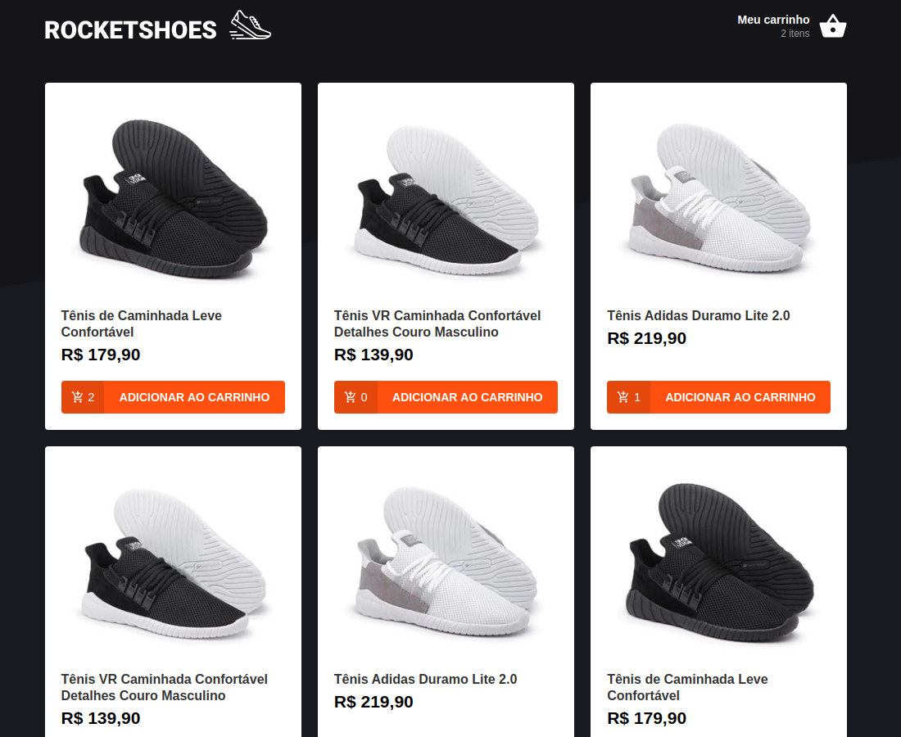
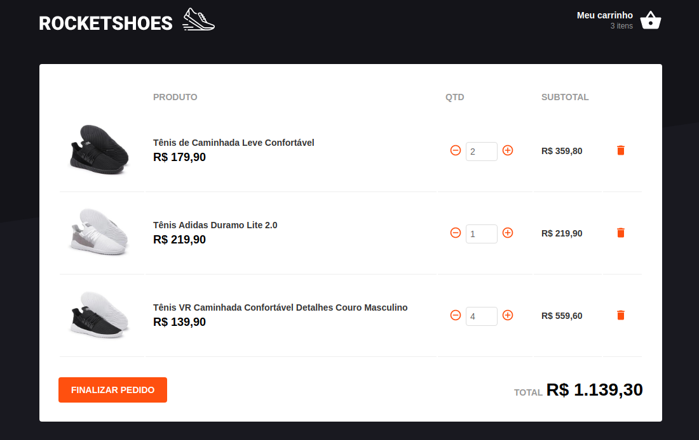

<h1 align="center">Rocketshoes</h1>

<p align="center">
  

  <a href="https://www.linkedin.com/in/helitonoliveira/">
    
  </a>

  

  <a href="https://github.com/heliton1988/rocketshoes/stargazers">
    
  </a>
</p>

<p align="center">
  <a href="#pencil-sobre">Sobre</a>&nbsp;&nbsp;&nbsp;|&nbsp;&nbsp;&nbsp;
   <a href="#wrench-ferramentas-utilizadas">Ferramentas utilizadas</a>&nbsp;&nbsp;&nbsp;|&nbsp;&nbsp;&nbsp;
  <a href="#arrowdown-como-utilizar">Baixe o projeto</a>&nbsp;&nbsp;&nbsp;|&nbsp;&nbsp;&nbsp;
  <a href="#pagefacingup-licença">Licença</a>
</p>

<h3 align="center">
  
</h3>

<h3 align="center">
  
</h3>

<h3 align="center">
  
</h3>

<br />

<p align="center">
    <a href="https://5f7dba07573f7f00084d9fbe--xenodochial-benz-1c8edb.netlify.app/">
    
  </a>
</p>

<br />

## :pencil: Sobre

Essa é uma aplicação que foi desenvolvida no Bootcamp GoStack da Rocketseat, visando aprender os conceitos e aplicabilidade da Arquitetura Flux.

## :wrench: Ferramentas utilizadas

- [ReactJS](https://pt-br.reactjs.org/)
- [Redux](https://redux.js.org/)
- [Redux-Saga](https://redux-saga.js.org/)
- [Styled Components](https://styled-components.com/)
- [React-Toastify](https://github.com/fkhadra/react-toastify)
- [Polished](https://polished.js.org/)
- [React-Icons](https://react-icons.github.io/react-icons/)
- [Immer](https://immerjs.github.io/immer/docs/introduction)
- [Axios](https://github.com/axios/axios)
- [Json-Server](https://www.npmjs.com/package/json-server)

## :arrow_down: Como utilizar

**Obs**: é necessário ter o `git` instalado em sua maquina.

```bash
# Clone o projeto
$ git clone https://github.com/heliton1988/rocketshoes.git

# Acesse a pasta do projeto
$ cd rocketshoes

# Instale as dependências
$ yarn / npm install

# Rode o front-end da aplicação
$ yarn start / npm run start
```

para rodar localmente a API desenvolvida usando `Json-Server`, siga os seguinte passos abaixo;

- Dentro da pasta `/rocketshoes` acesse a pasta `/service`
- Acesse o arquivo `api.js` e faça o seguinte;

```javascript
// troque a baseURL para localhost como no exemplo abaixo

const api = axios.create({
  baseURL: 'http://localhost:3000',
});
```

## :page_facing_up: Licença

Esse projeto está sob a licença MIT. Veja o arquivo [LICENSE](https://github.com/heliton1988/rocketshoes/blob/master/LICENSE) para mais detalhes.

Feito com 💙 by [Héliton Oliveira](https://www.linkedin.com/in/helitonoliveira/) 👋 !!!
